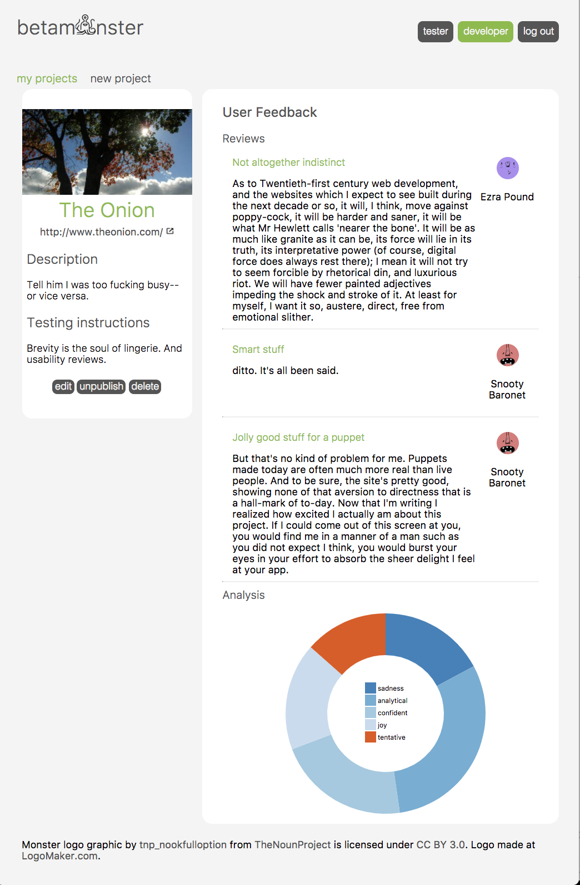

<!--  -->
# Betamnster

#### (Because every project's a monster at first.)
Betamonster is a single-page Angular app that streamlines the process of getting feedback on beta projects. Developers can add new projects they'd like users to test out, pose specific questions for users to respond to, access feedback from multiple users in one place, and see trends in the sentiments expressed in user comments.

They can also support their fellow developers by giving other beta apps a whirl.

## Tech
* Angular JS
* JavaScript, HTML, CSS (with Tachyons)
* IBM Bluemix
* D3
* Node.js
* Knex
* Express

## Appendages to come
* Screenshot images of beta landing pages (Webshot and Cloudinary)
* Word-cloud graphics to represent data from user reviews (D3)
* Copy-and-paste links to send friends directly to your project once they've signed up/in
* Customizable survey to target developers priorities
